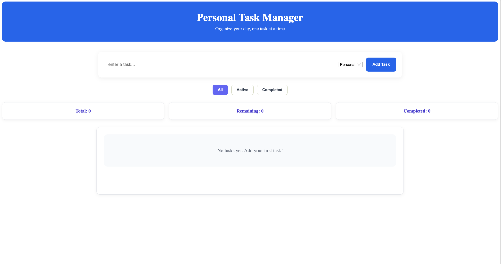
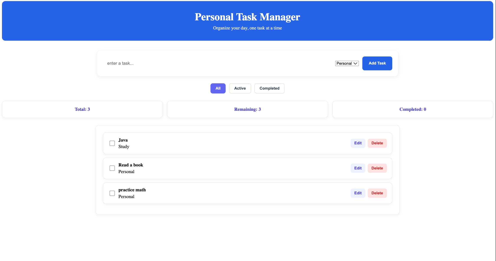
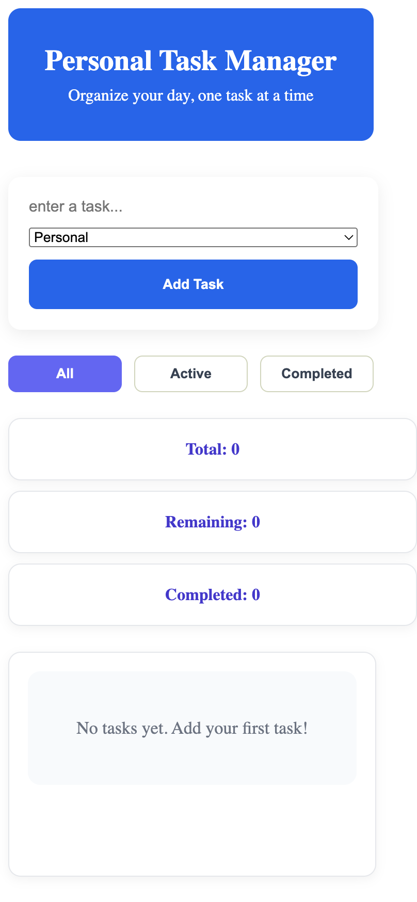

# Personal Task Manager 

A simple Personal task Manager Built with React.

## Description

This Project allows user to create and manage daily tasks using a simple and responsive interface.


## Features

- Add new tasks
- Edit tasks
- Delete Tasks
- Mark tasks as completed
- Filter tasks by All, Active and completed
- Displey total, remaining and completed task counts
- Save tasks using localStorage
- Responsive design for desktop and mobile

## Technologies

- React
- JavaScript
- Html
- CSS
- Vite
- LocalStorage

## Componrnts

- header
- TaskForm
- TaskFilter
- TaskStats
- TaskList


## Setup

1. Clone the repository.
2. Open the project folder.
3. Install dependencies:

```bash
npm install
npm run dev
```

## Project Structure

```text
src/
├── components/
│   ├── Header.jsx
│   ├── TaskForm.jsx
│   ├── TaskFilter.jsx
│   ├── TaskStats.jsx
│   ├── TaskList.jsx
│   └── TaskItem.jsx
├── App.jsx
├── main.jsx
└── index.css
```

## Screenshots

### Main Application



### Tasks Added



### Mobile View



## Limitations

- Tasks are stored in the browser using localStorage.
- Tasks are not synchronized between different devices.
- The application does not have user accounts.

## Author

Posan Budhathoki